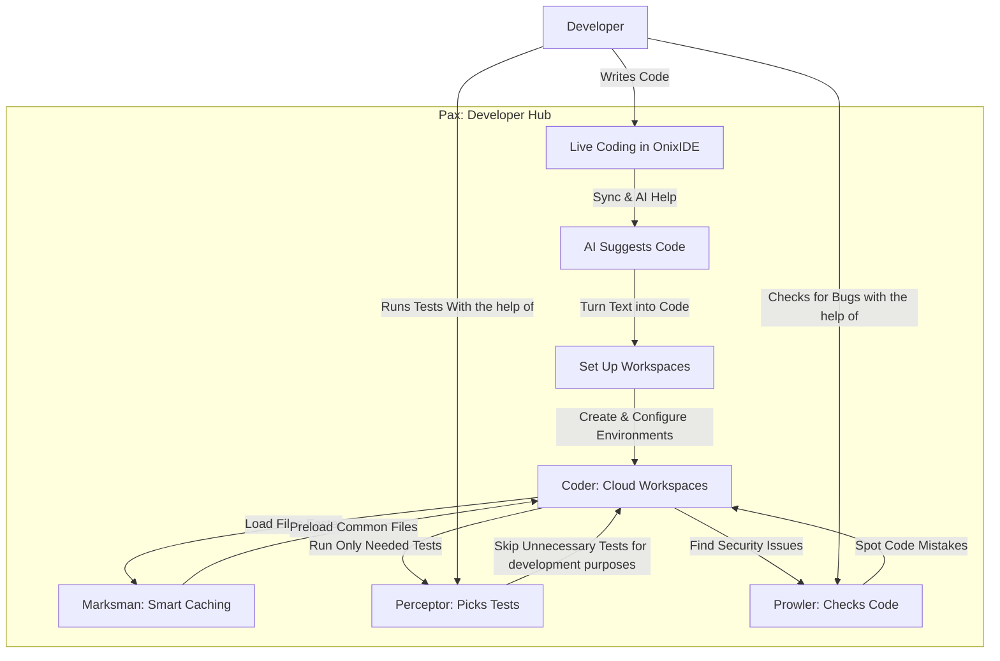
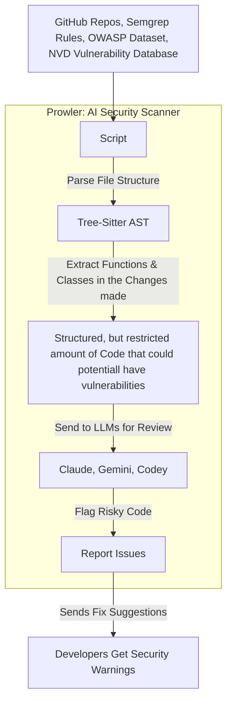
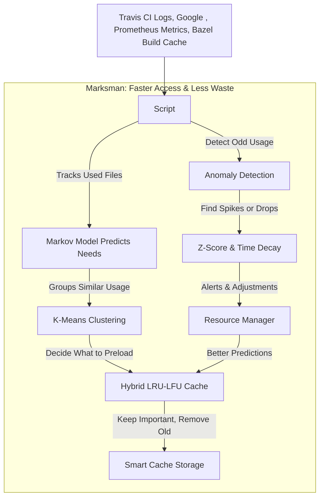
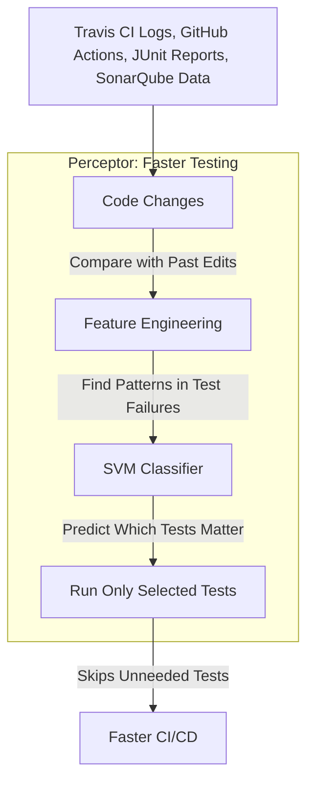
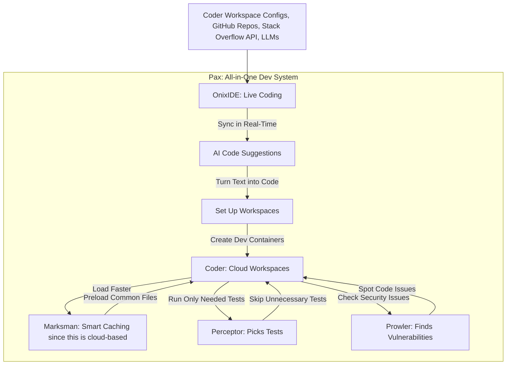
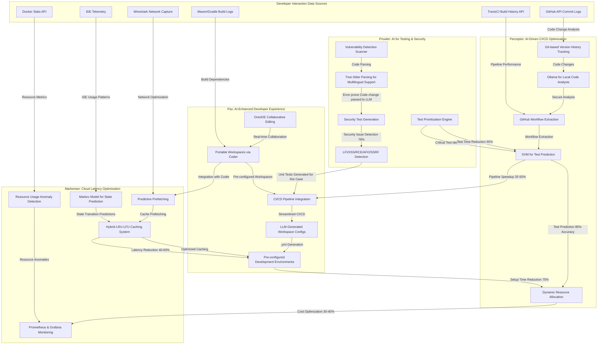

# Percy: AI-Powered Smart IDE and CI/CD Optimization

Percy is a four-pronged AI-driven solution optimizing CI/CD pipelines, automating testing and enhancing developer experience. It integrates multiple AI models to provide an end-to-end, efficient, and secure development environment.

## High-Level Design of Percy

## Components

### 1. Prowler: AI for Testing

Prowler enhances software testing through prioritization and vulnerability detection.

**Features:**
- Test Prioritization:
  - Uses Perceptor's changelog to identify crucial unit tests
  - Reduces test execution time by up to 65%
- Security Vulnerability Detection:
  - Scans for LFI, XSS, RCE, AFO, and SSRF vulnerabilities using predefined templates
  - Tree-Sitter integration for multilingual support
  - Reference: HikaruEgashira's vulnhuntrs repository
- Automated Security Tests:
  - Generates unit tests for vulnerabilities

**Research Citations:**
- VulnHuntr [[See](https://github.com/protectai/vulnhuntr/)]

### 2. Marksman: Optimizing Cloud Latency

Marksman reduces latency for cloud-based development environments.

**Features**
- Latency Reduction: Predictive caching and state-based optimizations using Markov Models
- Expected latency reduction: 40-60%

**Research Citations:**
- "An Improved Cache Eviction Strategy: Combining Least Recently Used and Least Frequently Used Policies (IEEE Xplore" [[See](https://ieeexplore.ieee.org/document/10454976)]

### 3. Perceptor: AI in CI/CD

Perceptor optimizes CI/CD through version tracking and test prediction.

**Features:**
- Code Tracking & AI Analysis:
  - Git-based version history tracking
  - Secure code change extraction via locally hosted Ollama model
- Intelligent Test Execution Prediction:
  - Extracts CI/CD workflows from .github/workflows
  - SVM model predicts necessary test cases

**Future Scope:**
- Cost optimization via dynamic resource allocation (estimated 30-40% savings)

### 4. Pax: AI-Enhanced Developer Experience

Pax enhances development workflow through collaborative editing and ready-to-use workspaces.

**Features:**
- Collaborative Editing: OnixIDE-based editing with real-time collaboration via websockets
- Portable Workspaces: Integration with Coder (GitHub: @coder) for pre-configured environments
- CI/CD Integration: Streamlined pipeline integration

**Future Scope:**
- Automated Workspace Generation: LLM-based .yml configuration generation for coder workspaces
- Integration with Go Backend of Coder for seamless processing (currently a temporary setup of .yml)

## More Detailed Workflow Overview

## Integration of Percy Components with Coder

### Technical Integration:

**Workspace Integration (Pax + Coder):**
- Automatic workspace configuration generation using LLMs
- Dynamic provisioning based on project type and CI/CD needs
- Setup time reduction: 75%

**CI/CD Optimization (Perceptor + Coder):**
- AI-driven test selection and workflow optimization
- Continuous model improvement using CI/CD run logs
- Pipeline execution speedup: 35-50%

**AI-Driven Testing (Prowler + Coder):**
- Real-time security vulnerability analysis
- Automated test recommendations before commits
- Security issue detection rate: 76%

**Latency Optimization (Marksman + Coder):**
- Markov Model predictions inform caching strategies
- Prefetching of dependencies reduces startup time by 45%

## Development Approach

Development approach for this particular application should follow an iterative development model:

1. Prototype Phase: Core functionality with modular AI models
2. Data Collection & Training: Using open-source repositories to collect workflow, vulnerability, etc. oriented data
3. Pilot Testing: Internal deployment with feedback loops
4. Scalability & Optimization: RL and Markov models implementation
5. Iterate: Return back to the Whiteboard based on user feedback

## Cost Analysis

**Component Costs:**
- Compute: ₹41–₹410 per hour on cloud services for LLM operation
- Storage: ₹8.2/GB per month (PostgreSQL/Elasticsearch)
- AI Model Training: ₹41,000 per model update
- Total projected annual cost: ₹1,230,000 to ₹2,050,000

**Cost Calculation Method:**
- Cloud provider pricing benchmarks (AWS, GCP, Azure)
- Per-pipeline compute load modeling
- Optimization via caching and batching (25% savings)

**Notes on Costs**
- Storage Costs: The cost mentioned is a general benchmark. Actual costs can vary based on the specific cloud provider and storage type (e.g., EBS on AWS costs around $0.135 per GB per month for General Purpose SSD)
- Compute Costs: The range per hour is broad and can vary significantly depending on the instance type and provider.
- AI Model Training: The cost of ₹41,000 per model update is a rough estimate.

## Rollout Strategy

1. Alpha Release (Internal): Controlled environment testing (Q1 2025)
Reasoning: Testing in a controlled environment allows for identifying and fixing issues early, ensuring the application is stable before external exposure. This phase helps in refining the product based on internal feedback, reducing the risk of major issues during later stages. 
2. Beta Release (Open Source): Developer community engagement (Q3 2025)
Reasoning: Engaging with the developer community provides valuable feedback and insights, helping to improve the application's functionality and user experience. This phase also fosters community involvement and can lead to contributions or suggestions for enhancements. This is also the time to generate hype around the software and eventually build a product that is **both useful and marketable**.
3. Enterprise Deployment: Cloud-optimized scaling (Q3 2026)
Reasoning: Scaling on cloud platforms ensures flexibility and scalability, which are crucial for handling increased demand as the application grows. 
4. Full Integration: CI/CD provider partnerships (Q2 2027)
Reasoning: Partnering with CI/CD providers facilitates seamless integration into existing workflows, enhancing efficiency and reducing deployment complexities

Also, engaging with both internal stakeholders during the alpha phase and external developers during the beta phase helps build support and buy-in. This engagement is crucial for ensuring that the application meets user needs and expectations

##### Resources:

1. GmbH, L. AI Strategy: Comprehensive guide & Best Practices | LeanIX. https://www.leanix.net/en/wiki/ai-governance/ai-strategy]
2. Kumar, S. (2025, February 17). 7 Essential steps for successful AI implementation in your business. CEI | Consulting. Solutions. Results. https://www.ceiamerica.com/blog/7-essential-steps-for-successfully-implementing-ai-in-your-business/

## Security and Privacy

**Security Measures:**
- Local AI Execution: Ollama for secure codebase handling
- Access Control: Role-based CI/CD pipeline access
- Data Encryption: AES-256 for logs and models
- Automated Security Audits: Continuous vulnerability scanning
- Compliance: GDPR, SOC2 compatible

## Data & Technical Expertise

**Dataset Access:**
- Public CI/CD logs, open-source repositories
- Synthetic datasets for RL model training
- GitHub Actions and Jenkins community collaboration

**Technical Partnerships: Possibilties**
- AI, cybersecurity, and DevOps domain experts
- Open-source community contributions
- Enterprise-scale deployment partnerships

A gentle note. The commit history shows two contributors, `unfortunatelygeek` and `dandanheads-Datahack`. I request the reviewers to please note that both users are me, Aditi Rao, only.
