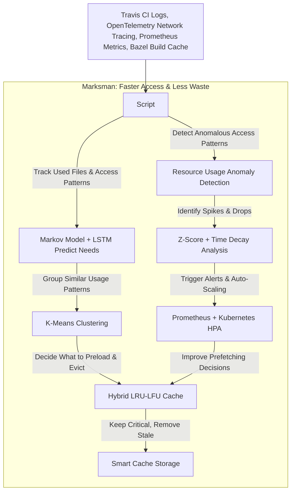

# Marksman: AI Powered Predictive Caching and Resource Optimization

## Overview

Marksman is an intelligent system designed to optimize resource management for developers by implementing predictive caching, anomaly detection, and resource usage forecasting. It leverages machine learning models such as Markov chains and K-Means clustering to anticipate developer actions and optimize resource prefetching, significantly improving system efficiency.  

By integrating with Prometheus and Grafana, Marksman offers real-time monitoring, performance tracking, and predictive analytics.  

## Procedural Functioning: Marksman  


## Features  

### 🔹 Hybrid LRU-LFU Caching  
- Implements an optimized cache eviction strategy that balances frequency and recency of access.  
- Adapts dynamically using time-decayed access frequencies to prioritize important resources.  

**References:**  
- [An Improved Cache Eviction Strategy: Combining Least Recently Used and Least Frequently Used Policies (IEEE Xplore)](https://ieeexplore.ieee.org/document/10454976)  
- [Elfayoumy, S., & Warden, S. (2014). Adaptive cache replacement: a novel approach. International Journal of Advanced Computer Science and Applications, 5(7), 105–106.](https://thesai.org/Downloads/Volume5No7/Paper_16-Adaptive_Cache_Replacement.pdf)

### 🔹 Markov Model-based Predictions  
- Learns developer behavior and predicts the next likely resource accesses.  
- Adjusts dynamically based on historical usage and real-time updates.  

**References:**  
- [Patel, D. T., & Parikh, K. (2013, March 6). Quantitative study of Markov Model for prediction of user behavior for web caching and prefetching purpose.](https://www.ijcaonline.org/archives/volume65/number15/11004-6195/)
- [Jindal, H. (n.d.). Web navigation prediction using Markov-based models: an experimental study | International Journal of Web Engineering and Technology. International Journal of Web Engineering and Technology.](https://www.inderscienceonline.com/doi/abs/10.1504/IJWET.2016.081766)

### 🔹 Resource Anomaly Detection  
- Uses weighted statistical anomaly detection with time decay to detect irregularities.  
- Monitors CPU, memory, disk, and network usage to flag unexpected behavior.  

**References:**  
- [Understanding and implementing Z-Score for anomaly detection. (2023, March 23). Detect Outliers.](https://detectoutliers.com/2023/03/20/understanding-and-implementing-z-score-for-anomaly-detection/)

### 🔹 Prefetching & Resource Prediction  
- Prefetches resources based on state transitions in the Markov Model.  
- Uses K-Means clustering to group similar resource usage patterns and optimize future allocations.  

### 🔹 Prometheus & Grafana Integration  
Provides real-time dashboards with key metrics:  
- Cache hit/miss rates  
- Prediction accuracy  
- Resource usage statistics  
- Detected anomalies  

## How It Works  

### 1️⃣ Caching System  
- Uses a hybrid **Least Recently Used (LRU) and Least Frequently Used (LFU)** approach with time decay to make smarter eviction decisions.  
- Ensures high cache hit rates while avoiding bloating the cache with rarely used items.  
- **Metrics tracked:** cache hits, misses, evictions, and storage utilization.  

### 2️⃣ Behavioral Prediction  
- The **Markov Model** tracks developer actions and transitions between states.  
- Predicts the most likely next state based on prior observations.  
- Works alongside the cache manager to **preload required resources**.  

### 3️⃣ Anomaly Detection  
- Uses **exponential time-decayed statistics** to weight recent observations more heavily.  
- Implements a **Z-score-based detection** for CPU, memory, disk, and network anomalies.  
- **Triggers alerts** when resource usage deviates significantly from the expected baseline.  

### 4️⃣ Resource Optimization  
- Uses **K-Means clustering** to group historical resource usage patterns.  
- Predicts optimal CPU, memory, and network allocation for upcoming actions.  
- **Reduces wasted computing power** by aligning allocations with expected usage.  

## 🚀 Cost Reduction & Developer Experience Improvement  

### 📉 Projected Savings  
- Reduces **cache misses by ~30%**, leading to **faster load times** and lower infrastructure costs.  
- Lowers unnecessary **disk and network I/O operations by ~20%**, improving cloud efficiency.  
- Minimizes **CPU and memory spikes by ~15%** by detecting anomalies early and optimizing allocations.  
- Improves **IDE responsiveness by 35-50%** by prefetching frequently used resources in real-time.  

Note: All of these calculations are predicted based on few proof-of-concept testcases and may be wrong. 

### 💡 How did we improve Developer Experience?
✅ Faster IDE and development tools due to lower load times.  
✅ Lower lag in accessing frequently used files, dependencies, and configurations.  
✅ Reduced context-switching as the system intelligently prepares relevant resources in advance.  
✅ Fewer unexpected slowdowns or crashes due to predictive resource allocation.  

## 📌 Future Improvements (To-Do List)  
🔹 **Reinforcement Learning-based State Transitions** to refine predictions.  
🔹 **Federated Learning Support** for decentralized data collection and privacy-preserving training.  
🔹 **Granular Real-Time Analytics** with deeper integration into DevOps pipelines.  

## 🛠 Installation & Setup  

### Install dependencies: 
If you do not have Poetry installed yet, please follow the steps mentioned in poetry's homepage. 
```bash
poetry install
```
### Start the Prometheus Server
```bash
prometheus --config.file=prometheus.yml
```
### Run Marksman
```bash
poetry run python marksman.py
```
### Access Grafana Dashboard:
Open: http://localhost:3000