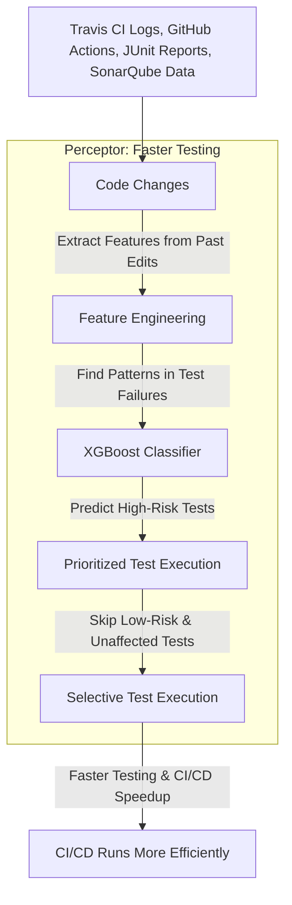

# Perceptor: Intelligent Test Execution Prediction within CI/CD pipeline and Intelligent Documentation

The primary goal of Perceptor is to predict which test cases are necessary for a given code change. This helps in optimizing the testing process by running only the relevant tests, thereby reducing execution time and resources. Perceptor also generates documentation based on the changelog, the added code and gitlog of the codebase. It uses a local LLM to do this, for security purposes.

## How Perceptor Works:

### 1. Intelligent Test Execution with XGBoost
- **Data Extraction**: Perceptor extracts CI/CD workflows from `.github/workflows`, analyzing build, test, and deployment steps.
- **Feature Engineering**: Key features from code changes, past test results, and build logs are extracted for training.
- **Model Training**: A XGBoost classifier learns patterns to predict which tests are necessary for a given change.
- **Prediction & Execution**: When new code is pushed, Perceptor dynamically selects relevant test cases, reducing unnecessary test runs.

### 2. Intelligent Documentation Generation
- **Extracting Code Changes**: Uses git logs, changelogs, and new code to understand what changed.
- **Context-Aware Documentation**: A local LLM analyzes changes and generates meaningful commit summaries, changelogs, and API documentation.
- **Security-Focused Processing**: By keeping the LLM on-premises, Perceptor ensures that sensitive data is never exposed externally.

## Why Do This?
Efficiency: By predicting and executing only necessary tests, Perceptor reduces the overall testing time and resource usage, making the CI/CD process more efficient.

## Challenges and Considerations:
- **Data Quality**: Accurate predictions rely on high-quality CI/CD logs and structured changelogs.
- **Model Maintenance**: The XGBoost model requires periodic retraining to adapt to evolving code patterns.