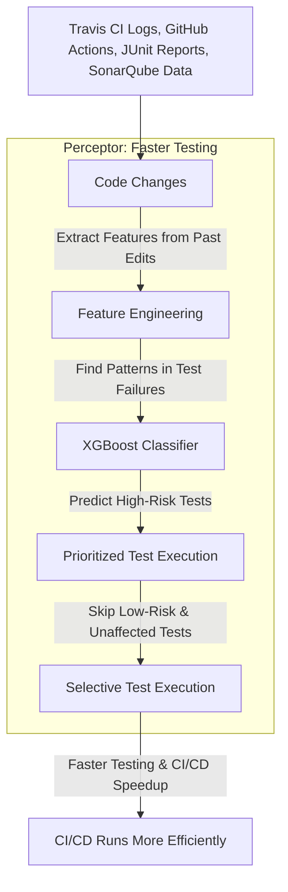

# Perceptor: Intelligent Test Execution Prediction within CI/CD pipeline and Intelligent Documentation

The primary goal of Perceptor **is to predict which test cases are necessary for a given code change**. This helps in optimizing the testing process by running only the relevant tests, thereby reducing execution time and resources. 

Perceptor also generates documentation based on the changelog, the added code and gitlog of the codebase. It uses a local LLM to do this, for security purposes.

## Dataset for Intelligent Testcase Detection:

The **ATCS dataset** provides three distinct testing corpora:

- ABB Robotics Industrial Tests: 850,000 test runs from manufacturing control systems
- Google Shared Dataset: 400,000 web service integration tests
- Open-Source Project Suite: 50,000 tests from 120 GitHub projects

Each record includes:

- Test case ID and version hash
- Code change diff (unified format)
- Previous execution results (10 most recent)
- Execution duration histogram
- Resource utilization metrics

### Temporal Dynamics in Testing Data
Modern continuous integration systems generate temporally correlated test outcomes that violate the i.i.d assumption of traditional machine learning. The Adaptive Test Case Selection (ATCS) dataset5 addresses this by including:

- Execution timestamps
- Historical pass/fail rates
- Code change differentials
- Test duration trends

These temporal features enable models to learn patterns like:

- Flaky tests that fail intermittently
- Tests tied to specific code modules
- Time-sensitive resource dependencies

## Feature Engineering

### 1. Temporal Features
`days_since_last_run` → Time elapsed since the last test execution.
`cycle_days` → Test cycle duration (mapped from "Daily", "Weekly", etc.).
`run_urgency` → Ratio of `days_since_last_run` to `cycle_days`.
`last_run_sin`, `last_run_cos` → Cyclic encoding of days_since_last_run (for periodic trends).

### 2. Test Execution Characteristics
`duration` → Test execution time (normalized).
`historical_fail_rate` → Ratio of failures to total runs.
`is_flaky` → Binary flag indicating test flakiness (alternating pass/fail pattern).
`recent_failures` → Count of recent failures in LastResults.
`last_result` → Outcome of the most recent test (0 = fail, 1 = pass).
`result_volatility` → Standard deviation of past results (measures inconsistency).

### 3. Test Metadata & Source Encoding
`source_*` → One-hot encoded test sources.

### 4. Normalization & Scaling
Features like `duration`, `historical_fail_rate`, `run_urgency`, `recent_failures`, and `result_volatility` are standardized using `StandardScaler()`.

## Applying Perceptor's `MarginPerceptron` 

The `MarginPerceptron` is a modified perceptron classifier that incorporates a margin to improve generalization and stability. Unlike a standard perceptron, which updates its weights whenever a misclassification occurs, this version only updates the weights when the margin condition is violated.

### Why Is It Defined This Way?

#### 1. Margin-Based Learning Rule

Instead of just requiring y * (w · x + b) > 0 (as in a standard perceptron), this model enforces a margin by checking:

This ensures that even correctly classified points must be confidently correct to avoid updates, leading to better separation and reducing overfitting.

#### 2. Weight and Bias Updates Only When Necessary

The weight and bias updates are only performed if the sample is too close to the decision boundary (i.e., violates the margin). The update follows the perceptron rule:

w = w + \eta yx
b = b + \eta y

where \eta is the learning rate.

### What does it predict?

The perceptron is a binary classifier that predicts +1 or -1 based on the sign of the linear decision function:

- This means it predicts which side of the hyperplane a given sample belongs to.

## Why is the `MarginPerceptron` a good model for Perceptor?

Perceptor is designed for test case failure prediction within CI/CD pipelines, where the goal is to prioritize test execution by identifying high-risk tests. The MarginPerceptron is a great fit for this use case because:

#### 1. Robust Classification with Margin-Based Learning
Traditional perceptrons update on every misclassification, making them sensitive to noise.
MarginPerceptron only updates when the confidence is low, ensuring that test cases with borderline failures are handled more carefully.
This helps reduce unnecessary retraining and makes predictions more stable.

#### 2. Works Well with Linear Separability in Test Outcomes
Many test failure patterns follow a linear decision boundary, where features like historical failure rate, flakiness, and urgency contribute linearly to failure likelihood.
The MarginPerceptron effectively captures linear relationships while enforcing a margin for robustness.

#### 3. Prioritizing High-Risk Test Cases
Perceptor doesn’t just predict failure—it prioritizes which tests are likely to fail with confidence.
The margin helps filter out low-risk test cases, ensuring that Perceptor focuses on high-confidence failures, leading to faster CI/CD cycles.

#### 4. Efficient & Lightweight Model for CI/CD
Unlike deep learning models, a perceptron is fast and interpretable, making it a great fit for real-time decision-making in CI/CD pipelines.
No heavy computation is needed, making it suitable for on-the-fly test scheduling and resource optimization.

✔ Margin-based confidence filtering → Avoids overfitting to noise.
✔ Lightweight & interpretable model → Works well in real-time CI/CD.
✔ Prioritization of high-risk tests → Optimizes test execution.
✔ Adaptability to unseen failures → Helps detect emerging issues.

## How Perceptor Works:

### 1. Intelligent Test Execution with Margin Perceptron
- **Data Extraction**: Parses CI/CD workflows and test execution data from the ATCS dataset.
- **Feature Engineering**: Extracts key signals like historical failure rates, test flakiness, and urgency from past test runs.
- **Model Training**: A Margin Perceptron learns patterns to determine which test cases are necessary, enforcing a margin to improve generalization.
- **Prediction & Execution**: When new code is pushed, Perceptor intelligently selects tests, prioritizing high-risk cases while reducing redundant executions.

### 2. Intelligent Documentation Generation
- **Extracting Code Changes**: Uses git logs, changelogs, and new code to understand what changed.
- **Context-Aware Documentation**: A local LLM analyzes changes and generates meaningful commit summaries, changelogs, and API documentation.
- **Security-Focused Processing**: By keeping the LLM on-premises, Perceptor ensures that sensitive data is never exposed externally.

## Why Do This?
Efficiency: By predicting and executing only necessary tests, Perceptor reduces the overall testing time and resource usage, making the CI/CD process more efficient.

## Challenges and Considerations:
- **Data Quality**: Accurate predictions rely on high-quality CI/CD logs and structured changelogs.
- **Model Maintenance**: The XGBoost model requires periodic retraining to adapt to evolving code patterns.