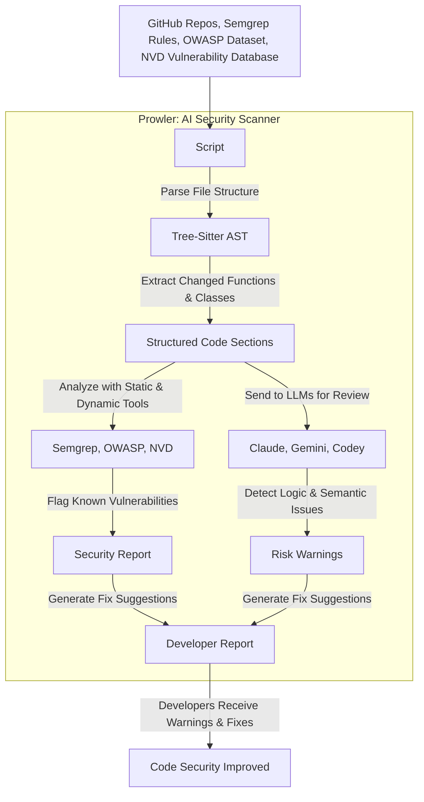

# Prowler: A Comprehensive LLM-Powered Vulnerability Detection System

## Overview  
Prowler is a powerful system designed to analyze source code for vulnerabilities using Large Language Models (LLMs) and code parsing techniques. It integrates multiple LLMs (e.g., Claude, Gemini, Ollama) to understand code contextually and detect security issues that traditional static analysis tools might miss.  

Zero-day vulnerabilities are previously unknown security flaws that attackers exploit before a fix is available. Traditional tools struggle with these because they rely on known vulnerability databases (e.g., CVE lists).

## Procedural Workflow For Prowler



### How Prowler Can Detect Zero-Days

#### Behavioral & Pattern-Based Detection
LLMs can identify suspicious code patterns that resemble past vulnerabilities, even if they aren't documented.
Example: If a newly introduced function accepts user input without sanitization, Prowler can flag it as potentially exploitable.

#### Anomaly Detection
By comparing the analyzed code against secure coding practices, Prowler can spot unexpected, risky code changes.
It can analyze open-source libraries to detect if new commits introduce hidden vulnerabilities.

#### Real-Time Updates
Prowler can be configured to monitor repositories continuously.
If a new vulnerability class is discovered (e.g., novel RCE techniques), the system can reanalyze codebases without waiting for CVE updates.

## Core Functionality  

### Repository Analysis  
- Prowler scans repositories to identify relevant Python files.  
- Extracts symbols (functions, classes, variables) for deeper codebase understanding.  

### LLM-Driven Vulnerability Detection  
- Sends code snippets to LLMs with structured prompts.  
- Detects vulnerabilities like injection attacks, insecure dependencies, and access control flaws.  
- Logs responses for review.  

### Error Handling & Rate Limits  
- Manages API failures gracefully (e.g., rate limits, connectivity issues).  
- Supports interchangeable LLMs to balance cost, accuracy, and availability.  

## Installation  
Prowler uses **Poetry** for dependency management. To install:  

```sh
poetry install
```
### Usage
Run Prowler using the following command:

```sh
poetry run python main.py
```
#### Available options:
```bash
  -h, --help            Show this help message and exit  
  -r ROOT, --root ROOT  Path to the root directory of the project  
  -a ANALYZE, --analyze ANALYZE  
                        Specific path or file within the project to analyze  
  -l {claude,gemini,ollama}, --llm {claude,gemini,ollama}  
                        LLM client to use 
  -v, --verbosity       Increase output verbosity (-v for INFO, -vv for DEBUG)  

```

## To-Do

Upcoming features include:

- Tree-Sitter Integration for multi-language support.
- AST-Based Analysis to improve structured vulnerability detection.
- Zero-Day Vulnerability Detection Enhancements for better anomaly detection.
- Automated Unit Test Generation to prevent security regressions.

## Future Scope Explored

#### Expanding with Tree-Sitter
Currently, Prowler is limited to Python because it relies on basic file parsing and LLMs. To make it language-agnostic, Tree-Sitter will be integrated.

##### Why Tree-Sitter?
- Multi-Language Support: Tree-Sitter provides an efficient parsing framework that supports many programming languages (C, C++, JavaScript, Go, Rust, etc.).
- Abstract Syntax Trees (ASTs): Instead of relying only on LLMs, Prowler can extract structured AST representations of code, making vulnerability detection more accurate.
- LLM Cost Reduction: By leveraging ASTs for preliminary analysis, Prowler can reduce API calls to LLMs, saving costs while maintaining accuracy.

How Tree-Sitter would enhance Prowler
1. More precise code understanding → LLMs get better structured inputs, improving detection accuracy.
2. Language-agnostic analysis → Expands beyond Python to detect vulnerabilities in C, C++, Java, and more.
3. Faster analysis → Tree-Sitter extracts key symbols quickly, reducing the workload for LLMs.

#### Unit Test Generation for Future Security
Beyond vulnerability detection, Prowler will eventually generate unit tests to prevent security regressions.

##### Why Generate Unit Tests?
- Ensures Fixes Are Permanent → Once a vulnerability is found and patched, unit tests ensure it doesn't reappear in future updates.
- Automates Security Testing → Developers won't have to manually write security test cases for every potential flaw.
- Shifts Security Left → By integrating automated security tests early in development, Prowler helps catch vulnerabilities before deployment.

##### How It Works
1. LLM identifies a vulnerability.
2. Prowler generates test cases that replicate the attack scenario.
3. Unit tests are added to the project, ensuring any future code changes are automatically checked for the same issue.

##### Example:

If Prowler detects an SQL Injection risk, it will generate a test case that injects malicious SQL payloads.
If the function still executes the query unsafely, the test fails, alerting developers to the vulnerability.

### External Documentation & Resources
- [VulnHuntr](https://github.com/protectai/vulnhuntr)